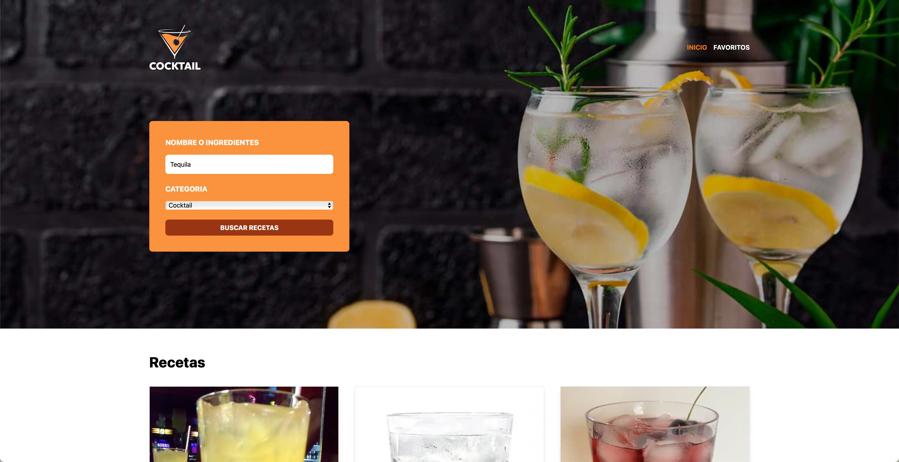

# Bebidas App API

### About this project
In this project we make an app that call an drinks API, this API has too many endpoints to use, but we use some of this endpoints to get the drinks depending of the input on a Form, then we can use this data to add some Favorite Drinks, this Favorites Drink are display on a different Page.

;


## Techs

- Typescript 
- AXIOS 
- ZOD 
- ZUSTAND 
- React Router DOM 
- TAILWINDCSS 
- HTML


## How can i used it?
First you wanna need to clone this repo

```bash
git clone <Repo_URL>
```
Then, you need to installed all dependencies:

```bash
npm run install
```

Finally, you need to start your development area

```bash
npm run install
```

## Live Project
🔗 https://bebidas-typescript.vercel.app
